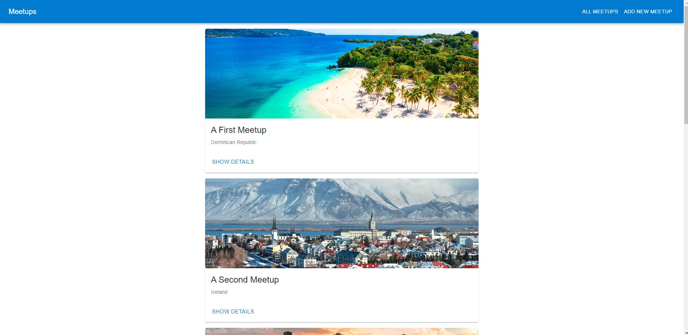
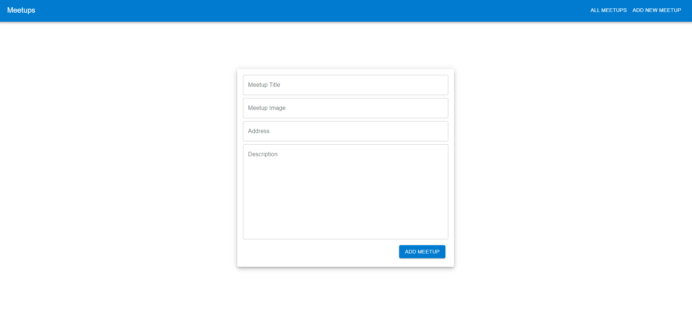
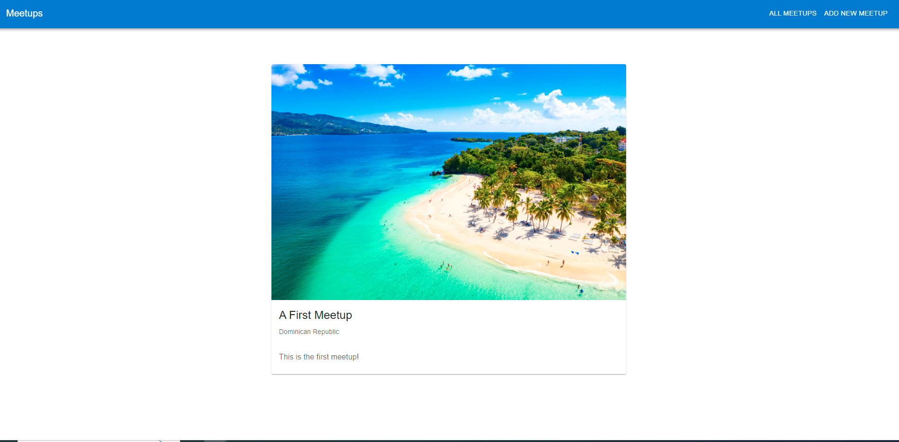

<!-- TABLE OF CONTENTS -->
<details open="open">
  <summary>Table of Contents</summary>
  <ol>
    <li>
      <a href="#about-the-project">About The Project</a>
      <ul>
        <li><a href="#Screenshots">Screenshots</a></li>
        <li><a href="#built-with">Built With</a></li>
      </ul>
    </li>
    <li>
        <li><a href="#installation">Installation</a></li>
    </li>
    <li><a href="#contact">Contact</a></li>
  </ol>
</details>

<!-- ABOUT THE PROJECT -->
## About The Project

    Meetup mangement project that allows the user to add new meetups and also view meeting details

### Screenshots

<p align="center">
  <p align="center">Meetup Page</p>
  
   </p>
<p align="center">
  <p align="center">New Meetup Page</p>
  
   </p>
<br />
<p align="center">
  <p align="center">Meetup Details Page</p>
  
   </p>
<br />

### Built With

* [Next JS](https://material-ui.com/)
* [React JS](https://reactjs.org/)
* [Material UI](https://nextjs.org/)


### Installation

1. Clone the repo
   ```sh
   git clone https://github.com/your_username_/Project-Name.git
   ```
2. Install NPM packages
   ```sh
   npm install
   ```
   
3. Run dev server
   ```sh
   npm run dev
   ```

<!-- CONTACT -->
## Contact

Siva Gopi - [linkedIn](https://www.linkedin.com/in/siva-kumar-gopi) - sivakumar1592.gopi@gmail.com

